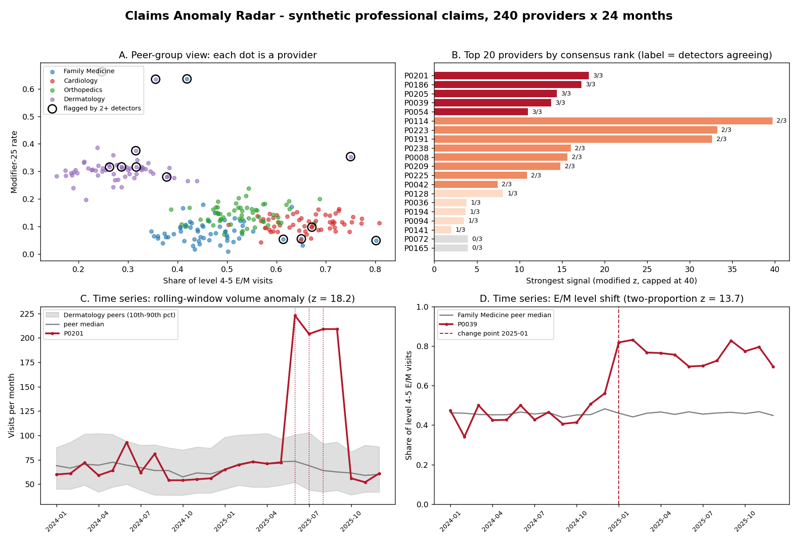

# Pattern Recognition for Payment Integrity: From Rules to Reasoning Agents

**Cotiviti Intern Assessment | Penghua Wang**
Ph.D. Candidate, Data Science and Analytics, University of Oklahoma | M.S. Statistics

**Topic:** Clinical Decision Making and Pattern Recognition in Health Care
(chain reasoning, agentic generative AI, classification, prediction, inference,
clustering, and time-series anomaly detection for treatment, payment, and operations).

This repository contains the deliverables requested in the assessment
instructions, uploaded directly as files. Nothing here contains real claims,
protected health information, or proprietary data; the proof of concept runs on
synthetic data generated by the script itself.

## Deliverables

| # | Deliverable | File | Notes |
|---|---|---|---|
| 1 | Written report (2 pages + APA references) | [`report/Penghua_Wang_Report.docx`](report/Penghua_Wang_Report.docx) | Concept, trends, opportunities and threats, three deltas on Cotiviti's existing capabilities; 21 verified sources including 2026 studies and OIG findings |
| 2 | Hackathon proof of concept | [`poc/claims_radar.py`](poc/claims_radar.py) | "Claims Anomaly Radar": one Python file, runs in about 6 seconds ([details](poc/README.md)) |
| 3 | Slide presentation | [`slides/Penghua_Wang_Slides.pptx`](slides/Penghua_Wang_Slides.pptx) | 10 slides with speaker notes |
| 4 | Video recording (under 5 minutes) | [`video/Penghua_Wang_Presentation.mp4`](video/Penghua_Wang_Presentation.mp4) | Slides, live POC demo, presenter on camera |
| 5 | Resume | [`Penghua_Wang_Resume.pdf`](Penghua_Wang_Resume.pdf) | |

## The argument in one paragraph

Payment integrity has moved from deterministic rules to statistical models and is
now moving to reasoning agents. Improper payments reached $28.8 billion in Medicare
fee-for-service and $37.4 billion in Medicaid in fiscal year 2025, and enforcement
is becoming analytics-led. The winning architecture is layered: statistical
detectors find the signal, an LLM agent assembles the evidence and the policy
citations, a critic agent checks them, and a human auditor makes the determination.
Recent evidence sharpens the design: unsupervised ensembles with explainable
rankings gave a five-fold lift in DOJ-validated fraud targeting (Shekhar et al.,
2026), while frontier browser agents almost never withheld a deficient
prior-authorization submission (Nie et al., 2026), so agents need a critic and a
withhold path. Cotiviti already fields most of
this stack (360 Pattern Review, Clinical Chart Validation, an AI governance program
since 2023), so the report proposes three deltas rather than new products: an
evidence-and-abstention layer for existing leads, time-aware change-point signals
for provider scoring, and a release gate for models and agents with overturn rate as
the headline metric. It recommends starting with the release gate and the
abstention layer together, in shadow mode.

## Proof of concept: Claims Anomaly Radar

A small, honest version of Options 2 and 1: complementary detectors, a consensus
rank, and a deterministic critic (a structural release gate: it checks that every
required element is present and consistent, not that a claim is true) that marks
every packet REVIEW or WITHHOLD. A human reviewer decides.

```
synthetic claims --> provider features --> three detectors --> consensus rank --> critic --> brief + scorecard
295K lines           8 billing-behaviour   A. peer-group robust z  detectors agreeing   5 checks:     policy source,
240 providers        measures per          B. time series (spikes, then signal          REVIEW or     evidence to request,
24 months            provider                 level shift)         strength             WITHHOLD      precision at K
15 injected anomalies                      C. Isolation Forest
```

```bash
cd poc
pip install -r requirements.txt      # numpy, pandas, matplotlib, scikit-learn
python claims_radar.py               # full run, writes poc/output/
python claims_radar.py --provider P0039   # one auditor brief (REVIEW)
python claims_radar.py --provider P0036   # a withheld packet (WITHHOLD)
python claims_radar.py --seeds 20         # robustness across seeds and contamination (~50 s)
python -m pytest -q tests                 # 6 tests
```

Tested with Python 3.12, numpy 2.4, pandas 3.0, matplotlib 3.10, scikit-learn 1.8.



| Result | Value |
|---|---|
| Designed anomalies in the top 15, fixed seed 42 | 14 of 15; the one non-anomalous provider in the top 15 was withheld by the critic |
| Precision at 5 / at 10 / at 15 over 20 seeds (median [IQR]) | 1.00 / 1.00 / 0.93 [0.93, 0.95] |
| Average precision over 20 seeds (median [IQR]) | 0.99 [0.97, 1.00] |
| Sensitivity to Isolation Forest contamination 0.03-0.10 | none (precision at 15 unchanged) |
| End-to-end runtime | about 6 seconds; 6 tests |

These are wiring checks on designed, deliberately clear anomalies, not estimates of
production accuracy. Ground truth is used only for the scorecard, never inside a
detector. An optional `--llm` flag has a language model write the brief, only for
packets the critic passed; the statistics still decide. See
[`poc/README.md`](poc/README.md) for design choices and limitations.

## Repository structure

```
.
├── README.md
├── Penghua_Wang_Resume.pdf
├── report/
│   ├── Penghua_Wang_Report.docx      # written report (2 pages + references)
│   └── build_report.js               # generator script (docx-js)
├── poc/
│   ├── claims_radar.py               # the proof of concept
│   ├── llm_brief.py                  # optional LLM-written briefs
│   ├── requirements.txt
│   ├── README.md
│   ├── tests/test_claims_radar.py    # 6 tests (pytest)
│   └── output/                       # sample run: flags, evidence, briefs, scorecard, robustness, dashboard, console log
├── slides/
│   ├── Penghua_Wang_Slides.pptx      # presentation (10 slides, speaker notes)
│   └── build_slides.js               # generator script (pptxgenjs)
└── video/
    └── Penghua_Wang_Presentation.mp4 # 5-minute recording
```

## Data and privacy

All claims, providers, and patients in this repository are synthetic and generated
by `poc/claims_radar.py` from a fixed random seed. Fee amounts are illustrative.
No real data, PHI, or Cotiviti materials were used.

## Contact

Penghua Wang | wangph86@gmail.com | Oklahoma City, OK | [github.com/StatGuyOU/cotiviti-intern-assessment](https://github.com/StatGuyOU/cotiviti-intern-assessment)
